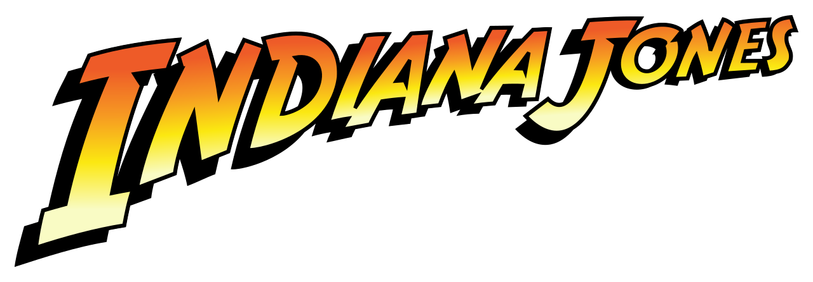
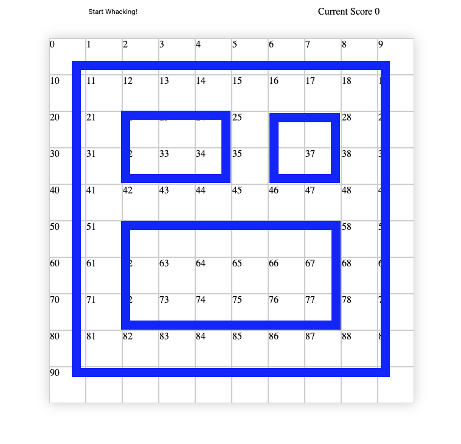
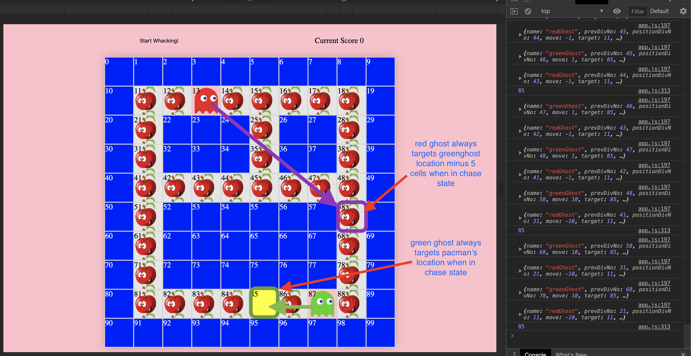
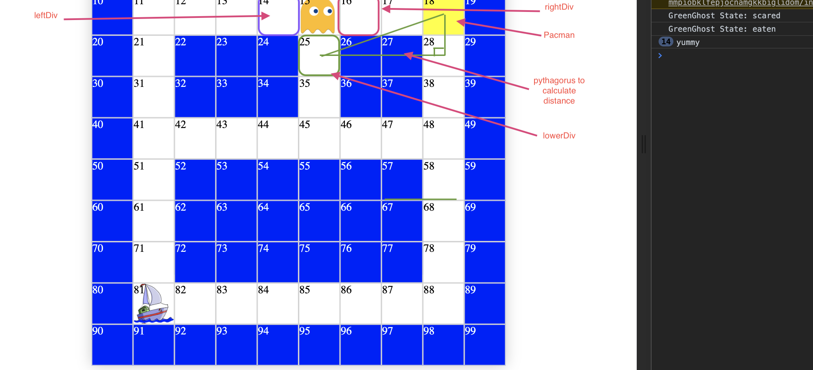
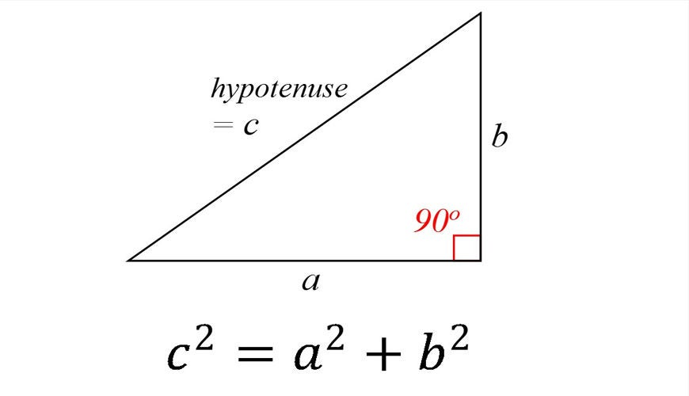
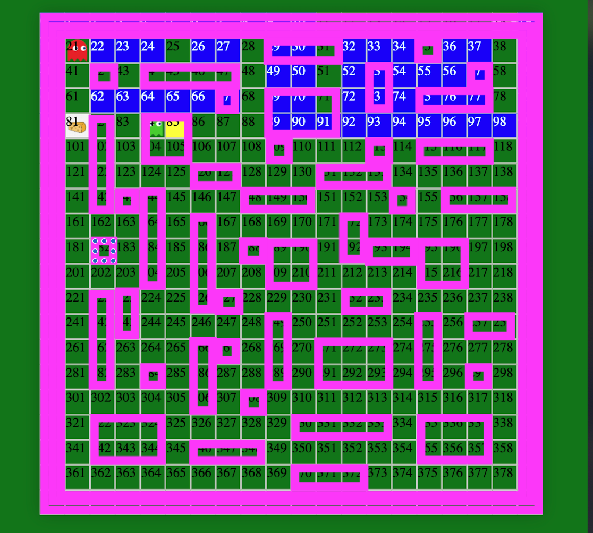
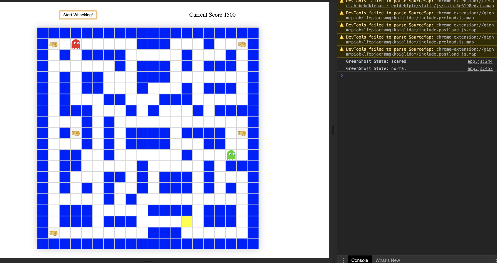
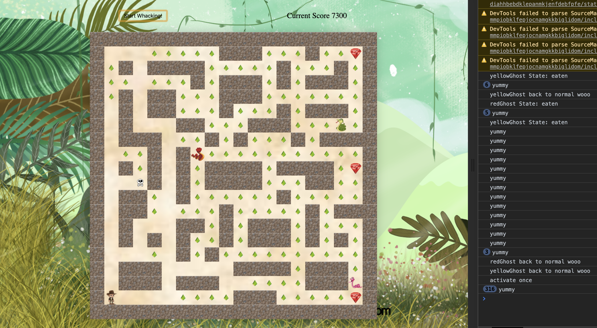

# SEI-Game-Project

Use the W,A,S,D keys to navigate around the map.

Note - The pacman game was styled at the end into an Indiana Jones’ theme. The below refers to ‘pacman and ghosts’ for ease of understanding.

Project Description:
Recreating PacMan using  HTML, CSS and vanilla Javascript only. Design and logic to be created from scratch with win/lose conditions and score tracking capabilities. I have re-skinned the game into an indiana jones theme and added a few extra twists and traps to the map for  more immersive temple runner experience.

Stage 1 - Pseudocode and Test Rig:

The two priorities at the start of the project was to write out all start/win/lose conditions and study the ghost behaviour.
I broke down the game into its separate elements and in order to test each one in a controlled setting independently of one another, I built a small scale test environment.
The test rig was essentially a sandbox and I was able to test the ghost logic, pacman’s movement and the conditions. This was a 10x10 grid with each cell having a seperate id.
Once these were all working as intended, it was a matter of overlaying the different systems and coordinating how they interact with each other.

Stage 2 - Grid Walls:

The cells array would contain the id of all grid elements but the wall cells would also be contained in the array wallCells. The wallCells array was used to add css styling to these (via adding classes to them) and also would be used as a check whether pacman or the ghosts could move into them. At this stage, the array was hard coded with the div ids to shape the wall positions on the grid.

Stage 3 - Movement:

Pacman and the ghosts are their own separate objects which contain properties to enable them to move around the map and change their behaviour. The main properties include:
 - PositionDivNo (the current Div index in the cells array)
 - Move (the value to be added to the PositionDivNo which will put the character into its next cell position).
 - Every 200ms, the setInterval functions will do: PositionDivNo + Move,  and then the new div number would be added with the pacman/ghost class so it looks like it is moving.

Pacman Movement

Pacman movement is all dictated by user input on the arrow keys. The way the grid is laid out, the up and down key would set the value of the move property to +20/-20 which would move pacman to the div above or below the current one it is in. If the div pacman would move to is contained within the wallCells array, it would not allow this and pacman would continue to move in his current direction.

Ghost Logic

The ghost logic was quite a tricky part to build the logic for. The ghosts have a property within them called target which they would always try to reach that target cell.
The basic principle is that each ghost has different states and the state will dictate what their target cell is. This causes them to behave in a certain way when these states change. The main rule for the ghosts movement is they cannot turn around so the logic needed to prevent the previous div position to be moved to. This target value is saved as a property in the ghost objects.

The states:
Scatter State = The ghosts each have a seperate corner of the map they go to as they each have a target cell there. (this alternates every 10s with chase state)
 Chase State = The ghosts target pacmans position and check his position every time they move.  (this alternates every 10s with scatter state)
Scared State = The ghost’s target changes randomly each second, causing them to move unpredictably.
Eaten State = Pacman has eaten the ghost and it needs to retreat to its ghostHome in the middle before it can respawn.

Chase State
When in chase state, the ghosts try to catch pacman and each have their own logic to do this. The green ghost will constantly check where pacman is and target that cell so it is always chasing on pacman’s tail.
The red ghost’s chase target is the green ghost’s position minus 5 squares so it slightly lags behind the green ghost so to can catch pacman if he tries to turn around and dodge the green ghost.
Yellow Ghost - This attempts to predict the next move of pacman and uses this as the target to create a trapping effect where pacman is stuck between two ghosts.
Pink Ghost - This ghost lags behind pacman's location slightly to create a dense population of ghosts behind pacman to make it difficult to navigate backwards.

Calculate The Best Route

After every move, the ghosts calculate the next cell to move to through the use of pythagorus theory.The ghosts calculate the direct distance from every cell around it to the target and the one with the shortest direct distance would be the next cell to move to. The logic will block the previous cell position and any wall cells from being moved to.

Firstly it is required to calculate the x and y value difference between the ghost’s surrounding cells and their target cell. This was done by using the offsetX and offsetY property which finds these values based on the window position. Once these values are known, it is known that the direct distance to the target can be found by doing a2 + b2 = c2.

The cell with the shortest distance which surrounds the ghost is where the ghost moves to. This cycle is then repeated over and over again after each move. This system does have it's flaws as the cell with the closest direct distance to the target does not necessarily mean that route is the least overall moves to get to that target cell.

Scared and Eaten State

These states were the hardest to implement because the other states can all be done on timers and all synchronized well together however these two states were caused by user interaction. The logic needed to break them out of the timers and do their own behaviours separately but also be able to return them back into the timers so they sync back up with the other ghost’s states. This was done through conditional statements which consistently checked the current state of each ghost and setTimeouts for them to be pulled back into the normal flow of the scatter/chase states. It was also important to implement many checks to evaluate the state of a ghost and change the class of the cell to show the correct visual icon at that cell (ie. scared ghosts need to use a scaredGhost class for css to style it properly)

Stage 4 - Win/Lose Conditions

The win and lose conditions were fairly simple to implement. Basically after every move, there are checks in place to see if the ghost divPosition is the same as pacmans’s divPosition. If the ghosts are in their normal states, pacman loses however if the ghosts are scared, the ghost is eaten. If the ghost is in it’s eaten state, nothing happens.

Scoring is also added at this point which basically would check if pacman divPosition is the same as a fruit divPosition. If so, the fruit class is removed from the div (removing the fruit icon) and the score is increased. 

Stage 5 - Scaling and Refactoring

Each element worked well independently and then overlaying them, they all worked together in the test environment so now it was the case to increase the size of the map to the actual size I wanted and design an interesting layout.

The layout I designed myself to give a bit of a mix of long narrow channels and open areas to navigate around to make a bit more dynamic gameplay as I thought the classic pacman map is a bit bland. 

Scaling was a bit of a problem as it identified areas where I had hardcoded some values and this messed up most of the logic as the grid was no longer 10x10 meaning the div positions were all a bit different. An example would be that to move up in the test rig, pacman’s div number would need to be -10 to go up. With a 20x20 grid, it now needs to be -20 to go up one square.

I was finding I needed to change a lot so it was best to re-write and refactor a lot of the code to ensure scalability can be achieved. This included things such as setting global variables which can be altered on the fly to allow for the map to scale in size or change the layout whilst every element acted as intended. 
This was also a good opportunity to review the naming conventions and update them so they improve readability as some of them were a bit vague.

Stage 6 - Finishing and styling

Once the code was refactored and everything was running intentionally with the larger map, I finished up with some styling to add a bit of character to the game. The original pacman is quite a basic layout and sprites used so I wanted to add a bit flair to this!

Stage 7 - Adding Traps

I wanted to add some additional features to spice up the game as I find pacman a bit vasuc on it's own (very good for the year it was released but games have become a lot more complex nowadays and I wanted to push for a bit more complexity in the gameplay). Using a combination of intervals and timers, I was able to use pressure plates around the map which activate either fire or holes to appear. These interact with pacman and the ghosts which can either kill you or earn you bonus points if you are able to trap the ghosts. Layering different classes onto different cells at different intervals and then checking if them cells had the player or ghost in them was used to build the game logic.

Stage 8 - Polishing and Audio

Finally just a bit of polishing and adding in audio to make the game a bit more immersive was important. I wanted to capture the feeling of being indiana jones running thorugh a booby trapped template and it could not be complete without the iconic theme tune! Audio on timers and triggered at different events adds a bit of depth to the game

Self Reflection:

Overall I had a lot of fun building the game, it certainly had it's challenges as there are quite a lot of things going on particularly when layering additional systems on top of each other. It was important to avoid using any frameworks so I could build a stronger foundation of the core HTML, CSS and JS skills. 

It was a great learning opportunity to understand the importance of scalable code and being respectful of the risks of adding new systems to a project. I feel as though there is certainly more work that can be done on the project, largely focusing on minimizing hardcoded areas so that the difficulty or the map can be changed at ease without breaking anything. 

